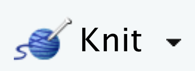
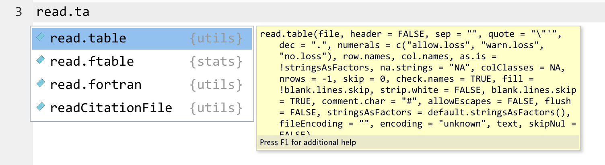
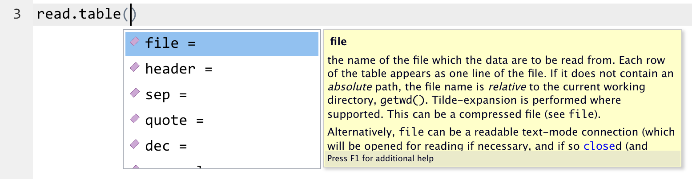
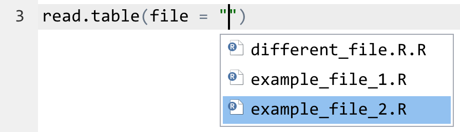
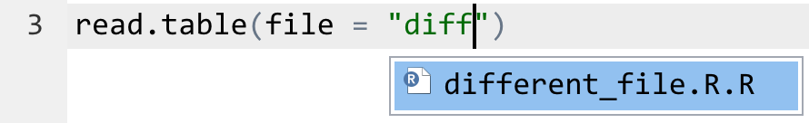
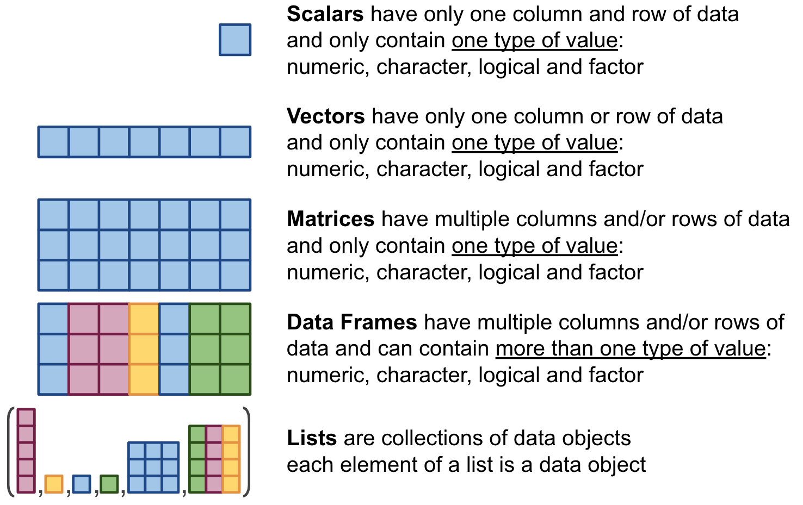
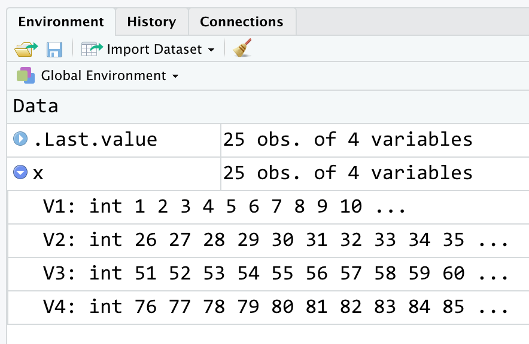
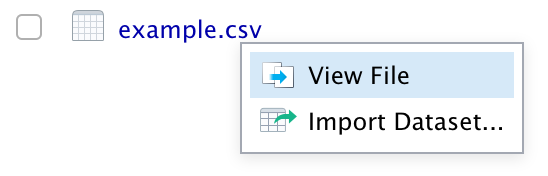

# Objectives

The objective of today's hands-on activity is to provide a basic overview of R.  For each topic covered, the first part will be directed: you will follow the prescribed sequence of R commands in order to familiarize yourself with what they do.  The second part of each topic will ask you to apply these R commands. 

# Assignment 

For this activity you will turn in a Rmd file that contains both code and written answers. 

**Always check that the Rmd file "knits" before submitting!**

## Knitting Rmarkdown documents

To be able to compile Rmd into HTML or any other format you will need to install the "knitr" library. 

If you do not already see a button at the top of the editor window that says "Knit" with an icon of a blue ball of yarn next to it, you will need to install this package. 

{width=100px}

- From the "Packages" tab in the bottom right pane click on "Install"
- Enter knitr as the package name, and then click Install
- From the main menu bar, select Session > Restart R
- The Knit button should now be visible

If you do have the Knit button, now you should click it. This will create a new file, that has the same name as the Rmd file, except it ends in `.html`. Rstudio should automatically preview this file for you. 
You will see that it contains exactly the same content as the Rmd file, but formatted nicely in to an east to read document. You are free to keep reading the assignment in either the Rmd file or the html file, but **you can only edit the Rmd file**. When you edit the Rmd file, your changes will not show up in the html file until you select Knit. **Kitting is the best way to check that all your code runs.**


## Formatting your assignments

For this activity you will turn in an Rmd file that shows your work.
All Rmd documents should start with a section that looks something like this:

```
---
title: "My Lab"
author: "My Name"
output: html_document
---
```
Make sure to give your file a title and put ***your name*** in the author field. Notice that the title and author need to be in quotes. 

In this document the `output` section is more complicated because it also contains the code for the table of contents. You don't need to edit it. 


### Code Answers

All your code should be placed into what we call "R chunks."

In the editor pane you can recognize them because: 

They start with: ` ```{r} ` (the `{r}` is very important because it's what makes it specifically an R chunk, as opposed to a different type of code chunk)

They end with ` ``` `

R code chunks also have in the top right hand corner three important icons (from left to right)
{width=100px}

1. Optional Settings. Once you get more comfortable using R, they can be useful.
2. Run the code in all chunks up to this one.
3. Run the code in this chunk.

Below is an R chunk. Try hitting the play button. 
You will see that the output appears below the code chunk. 
```{r}
1 + 2
```

### Written Answers 

Any verbal answers should be written in the space between code chunks. You can also include some of your written responses as commented code within the R chunk. Comments start with `#` and are not evaluated by R. Putting comments in code is very useful for remembering what you did when you come back to a file later.

There are multiple ways to format written answers and Rmarkdown is very versatile. What you do comes down to personal preference. 

**Always check that the Rmd file "knits" before submitting!**

### Example of a properly answered question 

1. **If there are 7 cats and 5 dogs, how many animals are there in total?**

```{r}
cats = 7 # there are 7 cats
dogs = 5 # there are 5 dogs
animals = cats + dogs # the sum of cats and dogs gives us the total animals

animals # this will print out the number of animals
```
From the calculations above, we can see that there are 12 animals in total. 

You can also use `` `r `` to reference calculations within your text , which has the advantage that you don't need to update your text if specific numbers change. For example:

We can see that there are `r animals` animals in total.

# R basics

## About R

The R software we are using this semester is open-source statistical software that has gained rapid popularity because of its power and flexibility.  In addition, there are a large number of "packages" for R that have been written by users and are freely downloadable from [CRAN](http://cran.us.r-project.org/) (Comprehensive R Archive Network).  Individual packages do everything from allowing R to interface with supercomputers to solving sudoku puzzles.  They contain most every classical statistical test you're likely to come across as well as interfaces that allow R to interact with a large number of other programs and software libraries.  Unlike many pieces of software you may be familiar with, R is a scripting language.  Usually you will be using R "interactively" which means that the basic mode of operation is to type commands at a command prompt and have it spit back a result, which you'll often want to cut-and-paste elsewhere.  

### What R has to offer

Through your web-browser go to http://www.r-project.org.  

* Please briefly look over the “What is R?” section.

*	Next, go to the “Manuals” section.  This section gives an overview of some of the on-line documentation you may want to use from time to time to gain a greater understanding of how R works and to solve problems you come across.  Some of today's activity is borrowed from the “Introduction to R”.  You are encouraged to read this section later on your own, especially if you have no previous familiarity with R or any other programming language.
*	Next, go to the “Search” section and in the “Google” box type in “mantel test.”  You'll find this gives you a list of different R packages that have different forms of mantel tests (a test of correlation between two matrices).  Press the back button and this time click on “Searchable mail archives” and again type “mantel test” in the query box.  This time you will see any discussions from the R email list about Mantel's tests.  These searches are often very useful if you're looking for an example or have run into a problem (because often someone else has had the same problem)
*	Next, go to the “CRAN” section, and select one of the sites – it doesn't matter which one since they are identical “mirrors” of each other.
*	Click on “Task Views” and then select one of the “tasks” that you find interesting.  You will then be presented with a brief overview of major subtopics within that area and the R packages that are useful for those types of problems.  These summaries are often an efficient way to familiarize yourself with what R has to offer for a specific type of analysis but are not exhaustive because new packages are constantly being added to R and not all types of analysis have a “Task View”.
*	Click on “Packages” and then “Table of available packages” and you will see a long list of all of the submitted R packages.  Look around a bit and then click on one you find interesting.  Here you will see basic info on the package including the “Depends” which is the list of packages that you need in order to use this package.  Click on the PDF “Reference manual”.  You'll find that the R documentation for a package describes the inputs and outputs of all the functions in the package and often provides examples of what code calling this function might look like.  However, most packages don't describe how a test works, its assumptions, or why you might want to use it – you'll usually want to look up info about a test rather than apply it blindly.

## Arithmetic operators

Lets see how R does some basic arithmetic. 

Notice that the code below is *not* in R chunks, only in generic code chunks, so it won't run automatically. You can see this because it is missing the `{r}` starting the code chunk. 

```
3 + 12        ## addition
5 - pi        ## subtraction
2 * 8         ## multiplication
14 / 5        ## division
14 %/% 5      ## integer division
14 %% 5       ## modulus (a.k.a. remainder)
10 ^ 2        ## power
```

Note: A pound sign (#) indicates a comment in the code. Everything after a # is not read by R and is just there for the benefit of the person reading the code (so you don't have to type it all in). 

Make sure you understand what each operator (`+`, `-`, `*`,`/`, `%%`, `%/%`, `^`) does before you proceed.  See this link https://www.tutorialspoint.com/r/r_operators.htm for more details. 

## Functions

R functions can be thought of as small programs that take in input values, referred to as the function "arguments," and perform certain tasks. These tasks may be to calculate a statistical value or to create a plot. 

You will recognize R functions because they have a name that is followed by a set of parentheses that contain their arguments.  In R there are many functions that can take more than one argument, and these arguments are always separated by commas.

For example there is a function in R for taking a square root: `sqrt()` 

```{r}
sqrt(25)  ## square root
```

There is a function for taking the factorial of a number: `factorial()`
```{r}
factorial(10) ## factorial

# This is much easier than:
10*9*8*7*6*5*4*3*2*1
```

Some of the other common mathematical operators in R that you should try running are:

### Exponentials and Logarithms 

```
exp(10)   ## exponential function exp(1) == 2.718282... (Euler's number, e)
log(10)   ## natural logarithm (i.e. ln)
log10(10) ## log base 10
log2(10)  ## log base 2
```

### Trigonometry 

```
sin(pi/2)           ## sine
cos(pi)             ## cosine
tan(pi/4)           ## tangent
asin(0.5)           ## arc-sine
acos(0.5)           ## arc-cosine
atan(1)*180/pi      ## arc-tangent
atan2(-1,-1)*180/pi ## arc-tangent (alternate version)
```
Note that the atan2 function takes TWO arguments. 

### Function Arguments

In later labs we will learn about writing functions. 

For now, it is important that you understand the concept of **function arguments**. 

If we specifically wanted to look up the arguments for `atan2()`, we can type

```{r}
args(atan2)
```

You may notice that the arguments have names: "x" and "y", but we ran the function `atan2(1,2)` without ever using these letters! 

```{r}
atan2(1,2)
```

This is because R is smart enough to do **"argument matching"** by **position** and automatically knows that since the documentation says `atan2(y,x)`, `y = 1` and `x = 2`.

Argument matching by position is convenient, but sometimes is unclear. It requires that you always remember the order of all the arguments. This can become very difficult! It is good practice to be **explicit** and always name your arguments. Added bonus: when you name your arguments, order no longer matters! 

```{r}
atan2(y = 1, x = 2) 
# Here I change the ORDER of the arguments but they are named!
# So the result stays the same 
atan2(x = 2, y = 1)  
```

## Practice

Here we can practice running code in the Console window (bottom left.) 

Type the following at the command prompt symbol '>':

```
3 + 12  ## addition
5 - pi  ## subtraction
z = 5   ## assignment to a variable
z             
y = sqrt(36)	## square root
y
```
 
The window should show

```{r, echo=TRUE}
3 + 12  ## addition
5 - pi  ## subtraction
z = 5   ## assignment to a variable
z             
y = sqrt(36)	## square root
y
```
  
The number [1] before the answers just means that this item is the first element of a vector (vectors can be thought of as a collection of related values, such as a column in a matrix). 

From these examples we can see a few things about R. 

   - First R knows the value of common constants such as $\pi$ `= pi` and $e$ `= exp(1)`  and can use them like numbers (`5 - pi`). 

   - Second, we can assign both constants and the results of functions to variables and we can see the value of a variable by entering it at the command prompt (`y = sqrt(36)`). 


## ★ Questions (1-5)

1. **Evaluate the following:**
   - a.	ln(1)
   - b.	ln(0)
   - c.	ln(e)
   - d.	ln(-5)
   - e.	-ln(5)
   - f.	ln(1/5)
   - g.	How does R represent when the output of a function is not a number?

2.	**Looking back at the Triginometry section, why were we multiplying the results of the atan and atan2 functions by 180/pi?**

3.	**What is the difference between log and log10?**  (Hint: use `help()`)

4.	**Pythagorean theorem**
  - a.	Given a right triangle with sides `a` and `b`, write a few lines of code that will calculate the length of the hypotenuse. 
  - b.	Try out your code with `a=5` and `b=13`.

5.	**Subtract the month you were born from the remainder left after you divide the year you were born by the day you were born (show code.)**

## Sequences

One of the most common tasks in programming is generating a sequence of numbers. 

There are two different ways to make sequences in R and it is important not to get them confused:

```{r}
# The first way generates a vector of ten integer values from 1 to 10 using a :
x1 = 1:10
x1

# The second way generates a vector of ten values from 1 to 10 using the seq() function
x2 = seq(from = 1, to = 10, by = 1)
x2
```

Why have two different ways to do the same thing?

Because the `seq()` function is much more powerful than `:`. 

`:` can only do steps of 1 (i.e. integers), but with `seq()`, you can have steps of any size:

```{r}
# Here we set the step size of .5
seq(from = 1, to = 10, by = 0.5) 
# Instead of specifying step size, we specify the length of the sequence 
# and get the same thing!
seq(from = 1, to = 10, length.out = 19) 
```
 
In all cases you need to provide the first value in a sequence, and after that you need to provide some combination of step size (by), length (length.out), and finishing value. This is a good example of why using argument names is important! 

```{r}
# The funtion rep() repeats a value a specified number of times
rep(1,10)
```

## Vector math

Most functions in R can be applied to vectors of data, not just individual data points.  Indeed, many only make sense when applied to vectors, such as the following that calculate sums, first differences, and cumulative sums.
 
```{r}
sum(1:10)  	    ## sum up all values in a vector
diff(1:10)		  ## calculate the differences between adjacent values in a vector 
cumsum(1:10)		## cumulative sum of values in a vector
prod(1:10)		  ## product of values in a vector
```
 
## ★ Questions (6-9)

6.	**Describe the difference in output between sum and cumsum.**
7.	**Generate a sequence of even numbers from -6 to 6**
8.	**Generate a sequence of values from -4.8 to -3.43 that is length 8** (show code)
  - What is the difference between values in this sequence?
9.	**What is the sum of the _exponential_ of the sequence in question 8?**

## Help and Documentation

### Searching for help and R documentation

To get information on a function in R you can precede the function name with a `?` or you can use the function `help()`.  

So if we wanted to look up information on the `atan2()` function, we can type either:

```
# These two commands will give us the same thing. Try typing them in to the command line.
?atan2
help("atan")
```

If on the other hand you are looking for a command (e.g. because you've forgotten the actual name of the function) you can use `help.search()`. For example:

```
help.search("mantel")
```
 
This will return a list of relevant functions with the parenthesis after the name indicating what package it is in. `help.search` will only search packages you have already installed, not all the ones that exist -- you'll want to use CRAN to find new packages.  

Within RStudio you can also search for help with commands in the **Help** tab in the bottom-right window. This search window combines the functionality of both ? and help.search.

To get new functions in packages that you do not currently have installed, you will have to look up the package you want to use and then install it. Packages are installed using the 'Install Packages' button under the "Packages" tab or by using 'install.packages' function on the command line. Packages are loaded by clicking the check box next to a packages name or by using the 'library' function at the command line. Packages only need to be installed once but need to be loaded every time you start R (hint: you'll probably want to list library commands near the top of your script files [described below])

### Auto-complete is your friend!

RStudio has the capacity to auto-complete function names, function arguments, and file names. 

For example, if you type ‘read.t’ and then hit TAB, RStudio will finish typing read.table and it will also show what information you can specify for the read.table function.  

{width=500px}

If you type read.table( and then hit TAB, RStudio will allow you to select the function argument that you want to fill in. 

{width=500px}

If you type read.table(“ and then hit TAB, RStudio will show you the files in your current working directory and allow you to select one. 

{width=300px}

If there are a lot of files in the directory, you can start typing the file name you want and then hit TAB again and RStudio will limit what it shows to just those files that match what you’ve typed so far.  

{width=300px}

# Data!

## R Data Types

There are many different types of data, and it is important that you not only understand the type data you are using, but that you clearly define the data type in R so that R can properly process it. 

Below are all the basic data types in R:

- **Numeric** (numbers with decimals): `12.3, 5, 999`

- **Integers** (whole numbers): `0, 2, 100`

- **Character** (sometimes called strings, always surrounded in quotes - either single or double): `"hello", 'a', "23.4"` Notice that once numbers are inside quotation marks, they become characters and cannot be used for computation.

- **Logical** (represents true and false, yes and no, 1 and 0, also called boolean): `TRUE, FALSE` Notice that these are NOT in quotes. 

- **Factors** (a more complex data type that helps categorize data and store it as levels)

## R Data Objects 

{width=600px}

We have already seen how to create scalars, as well as vectors that contain simple sequences. More generally you can create vectors using the `c( )` function that “combines” scalars of the same data type into a vector. You use it like this:
 
```{r}
x=c(1,7)
x
y=c(10:15,3,9)
y
z = c(TRUE,FALSE,TRUE)
z
```

You can also use `c` to combine vectors
```{r}
c(x,y)
```

But if you try to combine data of different types, R will try to convert them all to a single type (which isn't always what you want to happen)
```{r}
c(x,y,z)
```
 
We can also combine vectors to build up matrices and data frames by “binding” them together either are rows or as columns

```{r}
p = 1:10
q = 10:1
cols = cbind(p,q)  	# bind as columns
cols
rows = rbind(q,p)		# bind as rows
rows
```

`cbind` and `rbind` can also be applied to existing data frames, for example to add another column to an existing data frame or to take two data sets with the same columns and bind them together by row to make a larger data set.

You can also build matrices and data frames using the `matrix` and `data.frame` functions
```{r}
x = matrix(1:25,nrow=5,ncol=5)
x
y = data.frame(a = 1:3, b = seq(5,by=2.5,length=3), z=z )
y
```
You can see that in a matrix R fills in the table by rows by default and all the data is the same type. By contrast, with a data frame the component vectors can be different types but they need to be the same length. The `data.frame` function also lets you name the function arguments (almost) anything you want, and then uses those names as the column names in the table. Indeed, the syntax `z=z` meant "create a column named z and fill it with the contents of the variable z". The `list` function operates very similar to the `data.frame` but allows different elements to be different data objects and different sizes

```{r}
mylist <- list(a = 1,
               b = c(TRUE,FALSE,TRUE),
               c = matrix(1:9,nrow = 3,ncol = 3),
               d = "Australia"
               )

mylist
```
   
## ★ Questions (10)

10.	**Create a character vector that contains the names of 4 people you admire.**


## Loading and Saving Data

In practice, most of the time that we create vectors, matrices, data.frames, and lists we don't do it by hand, but rather we do it by loading in data that we want to manipulate, visualize, and analyze. This section focuses on how to get data into R.

### Environment 

When you assign a value to a variable you are saving that data in to the **Environment.**

```{r}
new_v = 3
```

If you run the code in the R chunk above, you should see the `new_v` variable appear in the upper right window under the Environment tab. 

You can always see what variables you currently have defined in the Environment window or by using the command
  
```{r}
ls()
```
 
Within the Environment window, clicking on a variable will show you the contents in a spreadsheet-like format in the Scripts window. Or if the variable has an arrow by it, you can click on it to expand it and see a preview of what it looks like.

{width=300px}

When we perform data analysis in R, **we do not open and edit the data files themselves.** This is may seem counter intuitive if you are used to using programs like Excel where you start by opening your data.  

Instead, we **load the data** in to R, i.e. we assign the data to a variable in the environment and then we do our analysis with that variable. This is good scientific practice because it means that we can never accidentally change our raw data. 

Note that if you just click on the file from within the **Files** tab, or try to open the file from File > "Open File..." that it may automatically open the file in a new editor tab or give you the option to "View File", but it it **doesn't load the data into R in any way we can use it.** You will know that you did not successfully load anything because the Environment will not change!

{width=300px}


### Loading ASCII Text Files

To properly load data, you need to know what format file you have. There are a number of ways to get information into and out of R, but the most simple is in ASCII text formats, such as tab-delimited (.txt) or comma-separated (.csv).  It's usually straightforward to export data in one of these formats from most any program (e.g. Excel).

Lets begin by opening the "Lab1_frogs.txt" file in the "data" folder. This data and some of the examples below come from Ben Bolker's handy book "Ecological Models and Data in R". 

Run the code below and then check for the dat variable in the Environment! Has it appeared?
```{r}
dat = read.table(file = "Lab1_frogs.txt", header = TRUE)
```

The second argument `header=TRUE` informs R that your data file has column headers that should be read rather than treated as just another line of data.  For the above command to work **R has to be looking at the correct folder**.  You can find out what folder R is currently looking at (its "working directory") using `getwd()` and you can change that directory using `setwd()` or under **Session > Set Working Directory**.  

CODING TIP: Programmers use the word **directory** instead of **folder**. The idea of "folders" didn't come around until computers actually had user interfaces and Windows made pictures to visualize where files were. 

```
getwd() # print out my current directory (or folder)
dir()   # what files are in my current directory?
```

### Saving to ASCII Text Files

For saving ASCII data there is an equivalent command to `read.table` which is `write.table`. Type ?read.table and ?write.table to learn more about these functions. While `read.table` and `write.table` can read and write CSV (comma separated value) files by just specifying the `'sep'` argument as `sep = ","` (i.e. a comma in quotes), there are also predefined functions `read.csv` and `write.csv`.

```{r}
write.table(x = dat, file = "my_frogs.csv", row.names = FALSE, sep = ",") ## save data as CSV
```

### The .RData File Format

R also has a built-in binary data format that is good for saving results for later use in R and can store any number of data types of different shapes and sizes (note just single tables). Thus, for example, the .RData format could be used to save multiple data sets associated with a particular project. 

The function `save` is used to make .RData files. This command saves any number of data objects, separated by commas, that come before the `file =` argument, which tells the function the name of the file you want to write to. Here we will save many of the variables we have created so far in this lab in one .RData object!

```{r}
save(dat,x1,x2,y,z, file = "Lab1.RData")
```
 
This data can then be reloaded at a later time, or on a different computer, using "load"
 
```{r}
load("Lab1.RData")
```
 
There is also a "save.image" function that saves every variable you have defined so far

```{r}
save.image("Lab1_all.RData")
```

These commands will be very helpful if you don't finish a activity by the end of the period and want to take your whole R desktop home, for saving work in progress, or archiving results of analyses. When you quit R you will be asked if you want to save your desktop and if you answer 'y', then save.image is called by default and will save to a file simply named ".Rdata" which is automatically loaded the next time you start R.  While this is convenient, we actually recommend against it and suggest using save or `save.image` explicitly instead because otherwise it is very easy to accidentally use variables and data sets defined in previous analyses, or to be unsure which version of an analysis you're working with.

### Other File Formats 

Finally, while we won't use these explicitly in this class, there are a large number of other options for getting data in and out of R in specific formats (e.g. GIS data, image data, etc) and ways to connect R to data sources more dynamically (e.g. SQL databases) that can be particularly useful when dealing with large data sets. The **R Data Import/Export** manual on the R website is a place to start to learn more about moving data in and out of R.

## ★ Questions (11-12)

11. Use R commands (e.g., do not click "import dataset" and use the dialog there) read in the file `met_hourly.csv` and assign it the variable name `met`

12. Save the matrix `x` to a csv file

## Data Exploration

One of the first things you'll do with any data set when you first load it up is some basic checks to see what you are dealing with.  Typing the variable name will show you its contents, but if you just loaded up something with a million entries then you'll sit for a long time as R lists every number on the screen. The `class` function will tell you the type of data you've just loaded.  
 
```{r}
class(dat)
```
 
The `str` function will tell you the basic structure of the data. From these we learn that there are four columns of data named "frogs", "tadpoles", "color", "spots" and that there are 20 rows of data, and that the data is numeric for the first two, a factor for the third, and logical for the fourth.
 
```{r}
str(dat)
```
 
The `names` function will tell you the names of the columns in you data frame. This may be more useful if we didn't need all the information from `str`.
 
```{r}
names(dat)
```
 
The `dim` function will tell you the dimensions of the data, in this case [1] 20 4 which means we 20 rows and 4 columns.  Each of these pieces of information is accessible individually using `nrow` and `ncol`. 
```{r}
dim(dat) # dimensions of the data (rows, columns)
```


```{r}
nrow(dat) # just the number of rows
ncol(dat) # just the number of columns
```

Note that `dim` will not work on a vector! Here we have to use the function `length(x)` to find the length of a vector. Similarly, `length` should not be used with a matrix or data frame. 

```{r}
x = 1:10 
dim(x) # dim does not work on a vector
length(x) # length works for a vector
```

The functions `head` and `tail` show just the first and last few lines of a data set, respectively.

```{r}
head(dat)
tail(dat)
```

The `summary` function will give you basic summary statistics on a data set.

```{r}
summary(dat)
```

## ★ Questions (13)

13. Use the commands above to explore the contents of `met`. Describe in words what this file contains and some of its characteristics.

### Next Steps

This concludes our overview of the basics of R. In the next lab we will learn how to use R to manipulate data (organize, subset, transform) and use R to create data visualizations.


<!-- Ignore code below this line, it's for formatting the table of contents. -->
<!-- ----------------------------------------------------------------------- -->
<div class="tocify-extend-page" data-unique="tocify-extend-page" style="height: 0;"></div>
